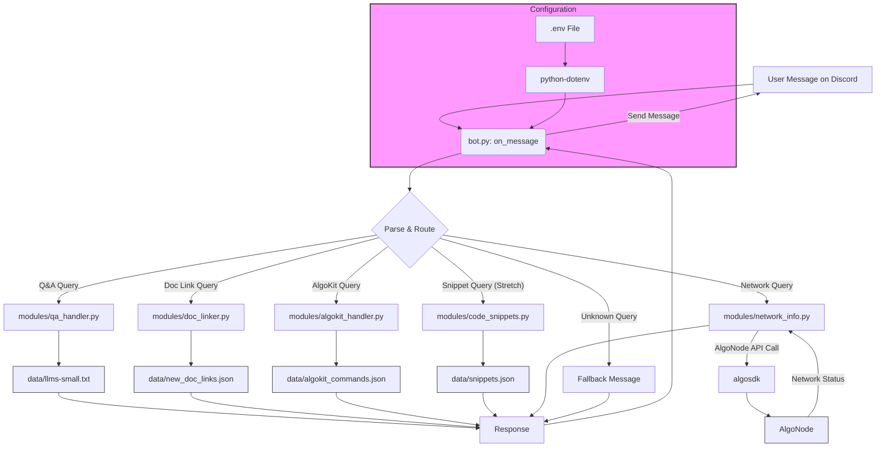

<p align="center">
  
</p>

<h1 style="text-align:center;">AlgoDevHelper AI</h1>

## Introduction

AlgoDevHelper AI is an interactive Discord bot designed to be an indispensable, context-aware AI companion for Algorand developers. Born during the Algorand Developer Retreat hackathon, its purpose is to significantly accelerate the learning curve, streamline troubleshooting, and enhance the overall developer experience (DX) when building on Algorand, with a specific focus on leveraging the capabilities and best practices introduced with AlgoKit 3.0 and the revamped Developer Portal (`dev.algorand.co`).

It addresses the friction developers face due to information fragmentation, the learning curve of new tools, the need for quick recall/reference, accessing real-time network data, and navigating community channel noise, all directly within the Discord workflow.

## Status

**MVP Complete & Polished (Hackathon Project)**

This project was initiated and the Minimum Viable Product (MVP), including initial polishing (code comments, documentation), was completed during the Algorand Developer Retreat hackathon (March 2025). The bot is ready for demonstration.

## Features

The current version provides the following core functionalities:

*   **Knowledge-Based Q&A:** Answers questions about core Algorand concepts and AlgoKit features using keyword matching against `data/llms-small.txt`.
*   **Contextual Documentation Linking:** Provides deep-links to the official Algorand Developer Portal (`dev.algorand.co`) based on keywords found in `data/new_doc_links.json`.
*   **AlgoKit CLI Assistance:** Offers quick summaries and documentation links for core `algokit` commands (`bootstrap`, `deploy`, `generate`, `init`, `localnet`) based on data in `data/algokit_commands.json`.
*   **Real-Time Network Information:** Fetches and displays the current consensus round for Algorand MainNet and TestNet using `algosdk` and AlgoNode.
*   **Fallback:** Provides a helpful fallback message for unrecognized queries.
*   **Code Comments:** Added comments throughout the Python code (`bot.py` and modules) for better readability and maintainability.

**Stretch Goals (Potential additions if time permits during the hackathon):**

*   Enhanced Q&A using a basic Hugging Face `transformers` pipeline.
*   Basic code snippets for common AlgoKit 3.0 tasks.
*   Simple conversational context (remembering the last topic).
*   Using Discord Embeds for cleaner responses.

## Technology Stack

*   **Language:** Python 3.9+
*   **Core Libraries:**
    *   `discord.py`: For Discord API interaction.
    *   `algosdk`: Official Algorand SDK for Python.
    *   `python-dotenv`: For managing environment variables.
    *   `requests`: For potential future HTTP requests.
*   **Data Format:** JSON (for structured mappings), Plain Text (for knowledge base).
*   **External APIs:** Discord API, AlgoNode API (MainNet/TestNet).

## Architecture Overview

The bot follows a modular architecture:

*   **`bot.py`:** Main application entry point, handles Discord events (`on_ready`, `on_message`), loads configuration, and routes requests.
*   **`modules/`:** Contains specialized Python modules for each core functionality (Q&A, Doc Linking, AlgoKit Help, Network Info).
*   **`data/`:** Stores the knowledge base (`llms-small.txt`) and curated mappings (`.json` files).
*   **`.env`:** File for storing configuration and secrets (API keys, bot token).



## Setup & Installation

Follow these steps to set up and run the bot locally for development or testing:

1.  **Prerequisites:**
    *   Python 3.9 or later installed (`python --version`).
    *   Git installed (`git --version`).

2.  **Discord Bot Setup:**
    *   Go to the [Discord Developer Portal](https://discord.com/developers/applications).
    *   Create a **New Application**.
    *   Navigate to the **Bot** tab and click **Add Bot**.
    *   **Copy the Bot Token** and store it securely. You'll need it for the `.env` file.
    *   Enable the **Message Content Intent** under Privileged Gateway Intents.
    *   Note the **Application ID**.

3.  **Create a Test Server:**
    *   Create a private Discord server for testing.

4.  **Invite Bot to Server:**
    *   Go back to the Discord Developer Portal -> Your Application -> OAuth2 -> URL Generator.
    *   Select the following scopes: `bot`, `applications.commands`.
    *   Select the following Bot Permissions: `Read Messages/View Channels`, `Send Messages`, `Embed Links`, `Read Message History`.
    *   Copy the generated URL and paste it into your browser.
    *   Authorize the bot to join your test server.

5.  **Clone the Repository:**
    *   The repository will be hosted under the Algorand Developer Retreat GitHub Organization. (Link to be added once created).
    *   Clone the repository: `git clone [repository-url]`
    *   Navigate into the cloned directory: `cd algo-dev-helper` (or your chosen directory name)

6.  **Set Up Python Virtual Environment:**
    *   Create a virtual environment (this isolates dependencies):
        ```bash
        python -m venv .venv
        ```
    *   Activate the environment:
        *   macOS/Linux (bash/zsh): `source .venv/bin/activate`
        *   Windows (Git Bash): `source .venv/Scripts/activate`
        *   Windows (CMD): `.venv\Scripts\activate.bat`
        *   Windows (PowerShell): `.venv\Scripts\Activate.ps1`
        (You should see `(.venv)` at the beginning of your terminal prompt).

7.  **Install Dependencies:**
    *   Install the required Python packages:
        ```bash
        pip install -r requirements.txt
        ```

8.  **Configure Environment Variables:**
    *   Create a file named `.env` in the project root directory (the same directory as `bot.py`).
    *   Add the following content, replacing `'YOUR_DISCORD_BOT_TOKEN_HERE'` with the actual token you copied earlier:
        ```dotenv
        # Discord Bot Token (Keep this secret!)
        DISCORD_BOT_TOKEN='YOUR_DISCORD_BOT_TOKEN_HERE'

        # AlgoNode API Endpoints
        ALGOD_MAINNET_URL='https://mainnet-api.algonode.cloud'
        ALGOD_TESTNET_URL='https://testnet-api.algonode.cloud'

        # Bot Command Prefix (Note the trailing space if desired)
        BOT_PREFIX='!algohelp '
        ```
    *   **Important:** Ensure `.env` is added to your `.gitignore` file to prevent committing secrets.

9.  **Set Up Data Directory:**
    *   Create a directory named `data` in the project root: `mkdir data`
    *   Download the knowledge base file: `curl https://dev.algorand.co/llms-small.txt -o data/llms-small.txt`
    *   *(The `data/llms-small.txt`, `data/new_doc_links.json`, and `data/algokit_commands.json` files should already exist if you cloned the repository).*

## Running the Bot Locally

1.  Ensure your Python virtual environment is activated (you should see `(.venv)` in your prompt).
2.  Run the main bot script from the project root directory:
    ```bash
    python bot.py
    ```
3.  The console should show log messages indicating the bot is connecting and loading data, followed by `Logged in as [Bot Name]...`.

## Usage

Interact with the bot in your Discord server using either:

*   **Prefix:** Start your message with the defined `BOT_PREFIX` (e.g., `!algohelp `).
*   **Mention:** Mention the bot directly (`@AlgoDevHelperAI`).

**Example Queries:**

*   **Q&A:** `!algohelp what is an ASA?`, `!algohelp explain state proofs`
*   **Doc Link:** `!algohelp link for AlgoKit installation`, `!algohelp docs for TEAL spec`
*   **AlgoKit Command:** `!algohelp algokit deploy`, `!algohelp command init`
*   **Network Status:** `!algohelp mainnet round`, `!algohelp testnet status`

## Configuration

The following environment variables are configured in the `.env` file:

*   `DISCORD_BOT_TOKEN`: Your unique Discord bot token (required).
*   `ALGOD_MAINNET_URL`: The URL for the Algorand MainNet node API (defaults to AlgoNode).
*   `ALGOD_TESTNET_URL`: The URL for the Algorand TestNet node API (defaults to AlgoNode).
*   `BOT_PREFIX`: The string that triggers the bot commands (defaults to `!algohelp `).

## Contributing

This project is open source and contributions are welcome! As this project originated from a hackathon, the initial focus is on establishing the MVP.

Potential ways to contribute (post-hackathon):

*   Report bugs or suggest features by opening issues on the GitHub repository.
*   Help expand the knowledge base (`llms-*.txt`) coverage.
*   Curate more documentation links (`new_doc_links.json`).
*   Add more AlgoKit command details (`algokit_commands.json`).
*   Implement planned features or stretch goals.
*   Improve code quality, add tests, or enhance documentation.

Please follow the standard fork and pull request workflow for contributions.

## License

This project is licensed under the **MIT License**. See the `LICENSE` file for details.
